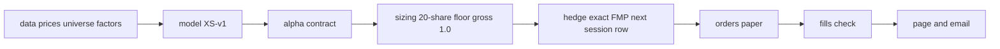

# Equity Factor Book (EFB)

## At a glance

- **What:** a full systematic long/short equity stack built from scratch on free
  data, following Paleologo's APM and EQI: risk models, hedging, sizing,
  transaction costs and ex-post attribution, across thirteen sprints.
- **Live:** a daily paper-traded book on Alpaca, factor-hedged with an exact
  factor-mimicking-portfolio hedge, running on a cron with automated
  reconciliation.
- **How it is built:** an implementer and a reviewer work through handoff files,
  every falsification criterion is pre-registered before the numbers exist, and
  every headline number is checked against a stored result by a traceability
  test.
- **Where to start:** [`docs/research/STATUS_REPORT.md`](docs/research/STATUS_REPORT.md).

Paleologo's risk and portfolio framework, rebuilt end to end on free equity
data: every component of *Advanced Portfolio Management* and *The Elements of
Quantitative Investing*, one sprint per component, each with pre-registered
pass/fail criteria written down before the numbers existed, and the whole stack
then taken live as a hedged long/short paper book that trades unattended every
evening. It is a measurement instrument, not a search for an edge. No signal
here is claimed to have one, and a documented negative result counts as a
finished piece of work if it prevents a bad decision later.

## What it found, honestly

- **The survivorship cost is real.** Buying today's index members and assuming
  they were always members earns **365.10 bp a year** more than a point-in-time
  universe (E1, F1.5), because only 44.79 percent of deleted members have
  recoverable history against a 70 percent bar.
- **Every candidate signal is NULL against the known factors.** All six signals
  failed the RG-Signal gate. The live book's factor-neutral IC is **-0.0031**
  (t -0.51) at horizon 21, against a raw IC of 0.0121 (t 5.04) at horizon 1.
- **The champion model is provisional.** XS-v1 wins the pre-registered champion
  rule, but F5.1 failed: no version is calibrated across all portfolio families,
  and the stress haircut is 1.8471.
- **The data layer is measurable even where the edge is not.** The equal-weight
  universe return correlates with the French market return at 0.9564 (E1, F1.3),
  and the survivorship measurement above is the single most consequential number
  the project produced.
- **Equity costs cannot be measured on free data.** Free daily OHLC cannot
  measure spreads for S&P 500 names, so the cost model is an assumption and E9's
  F9.3 is recorded not evaluable rather than failed.
- **The live book is a documented null by design.** It trades idio_momentum
  through the full stack, paper only, so the machinery can be watched on a signal
  whose expected attribution verdict was written down first.

## What running it live taught

- The alpha formula multiplied a **variance where its contract says
  volatility**, tilting the book toward whichever names moved most. Every test
  that checked only a sign or a ranking passed either way (`efb/alpha.py`;
  `docs/research/E11_live_launch.md`).
- A **CTVA spin-off was read as an 83.81 percent crash**, because the price
  vendor does not adjust its history for a spin-off. The research panel now
  corrects the cell from a recorded vendor row (`docs/hygiene_ledger.md`).
- **Broker enumerations arrived as text**, not as the values the code expected.
  The fix parses the text into the enumeration at the boundary and refuses a
  value it does not recognize (`docs/research/E11_live_launch.md`).

Each of those is a defect the code could not see from the inside, and finding
them meant reading what the system produced rather than what it said.

## The live system



## The live book

The book is a **paper** hedged long/short equity book at a final NAV of
$1,000,000. It holds the construction row the owner chose, the share-only floor
at 20 whole shares renormalized to gross 1.0, and hedges with the exact
factor-mimicking-portfolio hedge built on the next session's row. It runs
indefinitely, with a 30-trading-day reporting window that starts on the first
session whose orders filled after the flip. `main` carries the live loop; the
attribution engine and the credit port note sit on documented branches until the
live window has the days to evaluate them.

**Risk controls.** Every evening reads the account before it sizes anything and
refuses unless the reported account is the one `EFB_ALPACA_ACCOUNT_ID` names,
because EFB's paper keys and another project's sit under one login. An
establishment evening refuses if the account holds anything or has an order
working. Guard 1 caps any position at 0.10 of NAV, re-derived from the target
weight distribution rather than rescaled. The daily run refuses outside
16:00-20:00 New York unless `EFB_FORCE_HOUR` is the exact string `true`, and a
refusal sends a one-line email saying so. A kept name the $250 minimum skips is
a recorded leg, named in the email, that does not make the run incomplete. The
store never falls back on its own: a local run sets `EFB_STORE=local` to read the
parquet files under `live/state/`, and the cron does not, so a missing connection
string there is an error rather than a quiet write to a disk the next container
never sees. The page reads a JSON snapshot and fails loudly when it is late.

**How it is run.** Render runs only the cron jobs. The blueprint `render.yaml`
declares one service, `efb-live-daily`, which starts `scripts/run_cron.py` twice a
weekday, at 15:30 and 22:30 UTC; the hour in New York decides which job runs,
with the morning fills reconciliation before noon and the evening run from 16:00.
The evening extends the panel, fits the model, sizes the book, hedges it, sends
the paper orders and reconciles; the morning checks the fills. Live state stays
in Supabase and the run snapshot goes to a private bucket. The monitor page is a
Cloudflare Worker behind Cloudflare Access, described in `web/README.md`.

**Commands run by hand.**

- The local research console: `make dashboard`, one Streamlit tab per sprint.
- The order-timing smoke test:
  `python scripts/smoke_order_timing.py --symbol SPY --yes`, inside the 16:00 to
  20:00 New York window, submitting one share and cancelling it.
- The weekly review: `PYTHONPATH=. .venv/bin/python scripts/review_week.py`,
  one row per day with the P&L split into factor, idiosyncratic and cost.

## Where to look

- **A first look**: this file, then
  [`docs/research/STATUS_REPORT.md`](docs/research/STATUS_REPORT.md), the whole
  project in prose.
- **A quant researcher**: the sprint records under `sprints/E1` to `sprints/E13`
  (`PRD.md`, `TASKS.md`, `RESULTS.json` with every stored number and verdict), the
  research deliverables under [`docs/research/`](docs/research/), and the
  walkthrough notebooks under `notebooks/`, each of which reproduces its sprint's
  numbers, asserts every printed value against the artifact it came from, and
  closes with a "What E11 taught us" section.
- **A portfolio manager**: the live book section above, and
  [`docs/research/E11_live_launch.md`](docs/research/E11_live_launch.md) for how
  it was taken live, from the order that would have gone the wrong way to the
  pre-launch reviews that caught it. Every figure in it is checked back to a
  stored file by `tests/test_e11_live_launch_traceability.py`.
- **A credit desk**:
  [`docs/credit_port_design.md`](docs/credit_port_design.md), what transfers to
  corporate credit unchanged, what has to be re-specified, and the three places
  where unchanged is the wrong answer.
- **The working record**: [`handoff/`](handoff/) holds the standing rules, the
  current task, the reviewer's log and the implementer report.

## Limits

- **Paper trading only.** "Live" here means live data and a continuously running
  loop, never real money.
- **Free data.** Prices and share counts come from a retail vendor, membership
  from a pinned index changes table, factor returns from the French library, and
  sectors from a Wikipedia constituents table. The panel is survivor-only, which
  is measured rather than hidden.
- **No claimed alpha.** No signal survived the RG-Signal gate, the champion model
  is provisional, and equity costs are an assumption. A negative result is a
  complete outcome here.

## Repository map

- `efb/` - the Python package, one module per sprint
- `data/` - the parquet artifacts, with `VERSION.json` carrying their content
  hashes
- `sprints/` - one folder per sprint: PRD, TASKS, RESULTS, PROBES
- `docs/` - the ledgers, research deliverables and standards
- `notebooks/` - the walkthroughs
- `live/` - the paper-trading loop
- `render.yaml` - the Render blueprint: one service, the daily cron
- `scripts/` - the cron entrypoint and the operational scripts
- `handoff/` - the standing rules, the current task and the report

## Setup

```bash
python3.11 -m venv .venv
source .venv/bin/activate
pip install -e ".[dev]"
pre-commit install
make test
```
